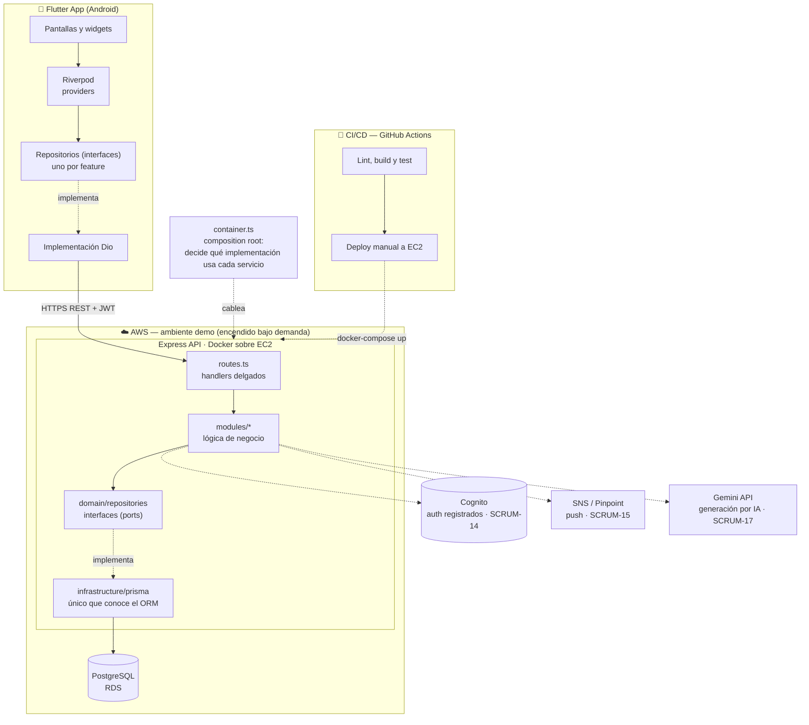
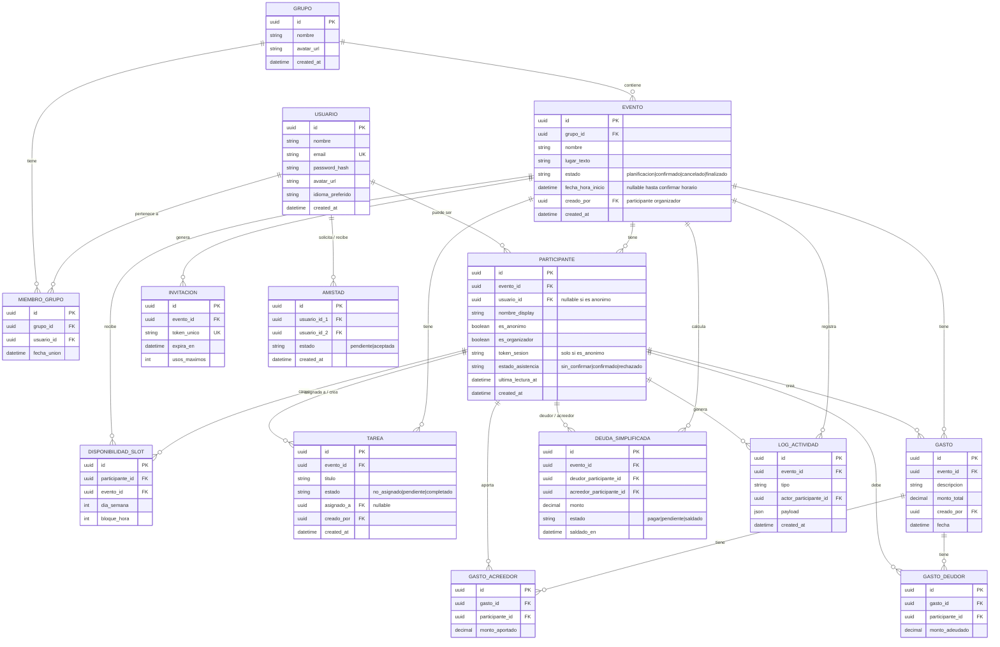

# Planify — Plan de Ejecución (Fase 2)

> ## ⚠️ Fuente de verdad
>
> **El Project Charter (PDF) y las épicas de Jira mandan sobre este documento.**
> Si algo acá contradice al charter o a Jira, gana el charter/Jira y este documento se corrige.
>
> - **Charter:** `entrega 2 PC.pdf` — objetivo, alcance, requerimientos, hitos, presupuesto y riesgos.
> - **Jira:** [`planify2026.atlassian.net`](https://planify2026.atlassian.net), proyecto `SCRUM` — 17 épicas con sus fechas. **Ninguna fecha de Jira se modificó ni se debe modificar sin consultar.**
>
> Este plan es la bajada técnica de esas dos fuentes: cómo se construye lo que ellas definen.
> Última verificación contra Jira en vivo: **2026-07-29** (las 17 épicas y sus fechas coinciden).

> Basado en [00-entendimiento.md](00-entendimiento.md), [00-ui-entendimiento.md](00-ui-entendimiento.md) y todas las decisiones registradas en [02-decisiones.md](02-decisiones.md). Design system detallado en [03-design-system.md](03-design-system.md).

## 1. Decisiones técnicas cerradas

| Área | Decisión | Justificación (1 línea) |
|---|---|---|
| Mobile | **Flutter (Dart)** | Ya presupuestado en el charter (capacitación Udemy) — [Duda #7](02-decisiones.md) |
| State management (mobile) | **Riverpod** | Más robusto y testeable que Provider/setState, es el estándar actual recomendado por el equipo de Flutter — buena práctica transferible |
| Cliente HTTP (mobile) | **Dio** | Interceptors nativos para adjuntar token de sesión/auth y manejar errores centralizado |
| Backend | **Node.js + Express (TypeScript)** | Cambio pedido por el usuario (reemplaza a NestJS) — más minimalista y sin decoradores; la inyección de dependencias se hace a mano en `container.ts`, que es explícito y fácil de seguir para un equipo júnior ([Duda #18](02-decisiones.md) y [#23](02-decisiones.md)) |
| ORM | **Prisma** | Migraciones declarativas fáciles de leer/revisar en PR, type-safety end-to-end, curva de aprendizaje baja — funciona igual de bien con Express que con Nest |
| Base de datos | **PostgreSQL en RDS** | Transacciones ACID necesarias para el algoritmo de simplificación de deudas ([Duda #3](02-decisiones.md), opción B) y NFR#4 (exactitud financiera) |
| Infraestructura | **AWS EC2 + RDS**, apagados fuera de testing/demo | Decisión pedagógica explícita — [Duda #8 revisada](02-decisiones.md) |
| Auth registrados | **Cognito** | Managed service, evita reinventar hashing/recuperación de contraseña; no compite con el objetivo de aprendizaje de EC2/RDS/redes |
| Sesión anónima | **Custom, sin Cognito** — JWT propio emitido por la API, scoped a `evento_id`, guardado en local storage del dispositivo | Coincide con [Duda #5 y F1](02-decisiones.md): identidad anónima vive solo mientras dura el evento |
| Notificaciones push | **SNS/Pinpoint (AWS)** | Consistente con backend en AWS — [Duda #10](02-decisiones.md) |
| Contenedores | **Docker + docker-compose** | Portabilidad dev↔EC2, facilita "prender/apagar" el ambiente sin reinstalar nada |
| Empaquetado/despliegue Android | **Play Store — pista de testing interno** durante todo el proyecto | Coincide con supuesto de distribución vía Play Store sin publicación pública real |
| Testing backend | **Jest + Supertest + fakes propios** | Los fakes en memoria (`test/fakes.ts`) implementan las interfaces de repositorio: los tests corren **sin base de datos**, incluida la API completa vía Supertest |
| Testing mobile | **flutter_test + fakes propios** | Mismo criterio: `test/helpers/fake_repositories.dart` implementa las interfaces, así que las pantallas se prueban **sin red**. No hace falta una librería de mocking |
| CI/CD | **GitHub Actions** | Gratuito, buena integración con EC2 vía SSH/Docker, curva de aprendizaje razonable para el equipo |
| Internacionalización | **flutter_localizations + archivos `.arb` (ES/EN)** | Estándar oficial de Flutter para i18n, exactamente lo pedido en [Duda #15](02-decisiones.md) (texto no acoplado al código) |
| Motor de IA (SCRUM-17, auto-generación de eventos) | **Gemini API (Google)** | Acceso gratuito vía la facultad — [Duda #21](02-decisiones.md), cubre el parseo de lenguaje natural sin costo contra el presupuesto de IA/APIs |
| Infra as Code | **Fuera del MVP** (scripts + consola AWS documentados; Terraform queda como backlog opcional) | El equipo ya tiene bastante curva de aprendizaje con EC2/RDS/CI-CD — no sumar Terraform obligatorio en 4 meses |

## 2. Arquitectura de la solución

> **Actualización (2026-07-28):** la arquitectura pasó a estar desacoplada por capas con inversión de dependencias (SOLID) — ver [Duda #23](02-decisiones.md). El objetivo es que un cambio se haga en un solo lugar y sea fácil de encontrar.

**Capas:**
- **Mobile (Flutter):** Presentación (screens/widgets) → Riverpod (state) → **Repositorios por feature (interfaz + implementación Dio)** → API REST.
- **Backend (Node + Express):** Routes → Services (lógica de negocio) → **Interfaces de repositorio (`src/domain`)** → Implementaciones Prisma (`src/infrastructure`) → PostgreSQL.
- **Infraestructura (AWS):** EC2 (contenedor Docker con la API) + RDS Postgres + Cognito (auth registrados) + SNS/Pinpoint (push) + S3 opcional (avatares).
- **CI/CD:** GitHub Actions construye, testea y despliega a EC2.

**Regla clave:** los servicios dependen de **interfaces**, nunca de Prisma. El único archivo que decide qué implementación concreta se usa es `backend/src/container.ts` (composition root). Migrar a Cognito, cambiar de ORM o agregar un caché es tocar ese archivo y la carpeta `infrastructure/`, sin abrir ni un servicio.



**Módulos del backend** (`src/modules/`, cada uno con su servicio; las rutas están centralizadas en `routes.ts`): `auth`, `participants`, `invitations`, `events` (comandos + consultas), `availability`, `groups`, `tasks`, `expenses`, `debts` (incluye `debt-engine.ts`, aritmética pura), `activity-log`.

**Features del mobile** (`lib/features/`, cada una con su carpeta `data/` de repositorios): `auth`, `home`, `groups`, `events` (creación en 2 pasos, disponibilidad/heatmap, asistencia, tareas, gastos y log de actividad), `balances`, `history`, `profile`.

> Gastos, tareas y log de actividad **no tienen carpeta propia en mobile**: viven dentro de `events/` porque siempre se usan en el contexto de un evento y comparten su pantalla. Es una desviación deliberada respecto de la estructura que planteaba la versión original de este documento.

## 3. Modelo de datos

**Nota de diseño (resuelta — [Duda #19](02-decisiones.md)):** el anónimo **no puede crear eventos**. En el MVP, todo `Evento` (y el `Grupo` que lo contiene) es creado por un **usuario organizador "fake"** — una fila de `Usuario` precargada por seed (email+contraseña, sin registro real todavía). Los usuarios anónimos solo se unen como `Participante` vía link de invitación, nunca son `es_organizador=true` ni crean `Grupo`/`Evento`. Esto elimina la ambigüedad que había quedado abierta sobre un "grupo transitorio" para anónimos — ya no aplica, porque el organizador siempre es un `Usuario` real en la base.



**Notas de negocio embebidas en el modelo:**
- `EVENTO.estado`: `planificacion` (recién creado, juntando disponibilidad/confirmaciones) → `confirmado` (horario definido) → `finalizado` (todos los `GASTO` saldados, según [Duda #5](02-decisiones.md)) o `cancelado` (por el organizador, según [Duda #2](02-decisiones.md) — no existe "archivado").
- `DEUDA_SIMPLIFICADA.estado` es lo que alimenta los 3 estados de Balances/Historial de [Duda #2](02-decisiones.md): **Pagar** (yo soy deudor), **Pendiente** (yo soy acreedor, no me pagaron), **Saldado**. Se recalcula cada vez que se crea/salda un `GASTO` (motor de simplificación tipo Splitwise — [Duda #3](02-decisiones.md)).
- Badge "NUEVO" de Groups = `EVENTO` con `created_at` reciente dentro de ese `GRUPO` ([Duda #2](02-decisiones.md)).
- Contador de no leídos por grupo = suma de `LOG_ACTIVIDAD` con `created_at > PARTICIPANTE.ultima_lectura_at`, agregado por todos los eventos del grupo.
- `TAREA.estado`: `no_asignado` → `pendiente` (asignada) → `completado` ([Duda #4](02-decisiones.md)).

## 4. Estructura de carpetas

```
planify-lab4/
├── docs/
├── mobile/                             # Flutter app
│   ├── lib/
│   │   ├── core/
│   │   │   ├── theme/                  # tokens del design system
│   │   │   ├── models/                 # modelos de dominio (parseo de la API)
│   │   │   ├── network/                # cliente Dio + TokenStorage (interfaz propia)
│   │   │   ├── data/                   # ApiException: errores traducidos, sin Dio
│   │   │   └── widgets/                # componentes compartidos
│   │   ├── features/                   # cada feature tiene data/ (repositorios) + pantallas
│   │   │   ├── auth/data/              # AuthRepository (interfaz + Dio)
│   │   │   ├── events/data/            # Events, Availability, Tasks, Expenses, ActivityLog
│   │   │   ├── events/widgets/         # diálogos de gasto y tarea
│   │   │   ├── groups/data/            # GroupsRepository
│   │   │   ├── balances/data/          # BalancesRepository
│   │   │   ├── home/, history/, profile/
│   │   ├── l10n/                       # .arb (es, en) + generated/
│   │   └── main.dart
│   └── test/
│       └── helpers/                    # fakes de repositorios + appDePrueba
├── backend/                            # Node + Express app
│   ├── src/
│   │   ├── domain/                     # ← no depende de nada
│   │   │   ├── entities.ts             # tipos puros (sin Prisma)
│   │   │   └── repositories/           # interfaces (ports), una por agregado
│   │   ├── infrastructure/             # ← único lugar que conoce Prisma
│   │   │   ├── prisma/                 # una implementación por repositorio
│   │   │   └── servicios-externos.ts   # bcrypt, JWT, clock, uuid
│   │   ├── modules/                    # lógica de negocio, un servicio por área
│   │   │   ├── auth/, participants/, invitations/
│   │   │   ├── events/                 # comandos (service) y consultas (queries)
│   │   │   ├── availability/, groups/, tasks/
│   │   │   ├── expenses/
│   │   │   ├── debts/                  # debt-engine.ts: aritmética pura en centavos
│   │   │   └── activity-log/
│   │   ├── middlewares/                # guards, asyncHandler, errorHandler
│   │   ├── common/                     # errores tipados
│   │   ├── container.ts                # ← composition root: qué implementación usa cada cosa
│   │   ├── routes.ts                   # todas las rutas, agrupadas por épica
│   │   ├── app.ts                      # arma Express a partir del container
│   │   └── server.ts                   # entry point
│   ├── prisma/                         # schema, migrations, seed
│   └── test/                           # fakes.ts + test-container.ts + suites
├── infra/
│   ├── docker-compose.yml
│   └── README.md                       # provisioning AWS paso a paso
└── .github/workflows/                  # CI por PR + deploy manual a EC2
```

**Dónde tocar según qué cambie:**

| Si cambia… | Se toca… |
|---|---|
| Una regla de negocio | `backend/src/modules/<área>/*.service.ts` |
| La forma de guardar datos | `backend/src/infrastructure/prisma/` |
| El proveedor de auth, hash o tokens | `backend/src/infrastructure/servicios-externos.ts` + `container.ts` |
| Un endpoint | `backend/src/routes.ts` |
| Un color, spacing o tipografía | `mobile/lib/core/theme/` |
| Un texto visible | los dos `.arb` de `mobile/lib/l10n/` |
| Cómo se llama a la API | `mobile/lib/features/<feature>/data/` |

## 5. Backlog completo

> Reestructurado para calzar **exacto** con las 17 épicas ya creadas en Jira (`planify2026.atlassian.net`, proyecto `SCRUM`) — ver [Duda #20](02-decisiones.md). Las fechas de cada épica son las que están cargadas en Jira; no se modificó ninguna. Prioridad: **Alta/Media/Baja**. Estimación relativa: **S / M / L / XL**. Los tiempos asumen trabajo asistido por IA (más rápido que una estimación tradicional), por decisión explícita del usuario.

### SCRUM-5 — Capacitación (06/08 – 12/08)
- Capacitación Flutter (ya presupuestada en el charter)
- Capacitación básica AWS (EC2/RDS/Cognito) y Node/Express — recursos gratuitos (AWS Skill Builder, docs oficiales), asistida por IA

### SCRUM-6 — Setup de Infraestructura (13/08 – 14/08)
*Tareas técnicas, no historias de usuario. Ventana corta — se acepta el riesgo asumiendo trabajo asistido por IA ([Duda #20](02-decisiones.md)).*
- **T-01** Provisionar AWS (cuenta, EC2, RDS Postgres, Cognito básico) — `M` — Depende de: nada
- **T-02** Setup monorepo (estructura de carpetas, README, linters) — `S` — Depende de: nada
- **T-03** Setup Express + Prisma + primera migración (Usuario, Grupo, Evento, Participante) — `M` — Depende de: T-01, T-02
- **T-04** Setup Flutter project + tema del design system + Riverpod + Dio + scaffolding de i18n (`.arb` es/en desde el día 1) — `M` — Depende de: T-02
- **T-05** CI/CD básico: GitHub Actions (lint + test en PR) + script de deploy manual a EC2 — `S` — Depende de: T-01, T-03
- **T-06** Docker + docker-compose (backend + Postgres local, réplica de EC2) — `S` — Depende de: T-03
- **T-07** Seed de usuario(s) organizador(es) "fake" (email + contraseña precargados) para crear eventos en el MVP sin auth real — `S` — Depende de: T-03 ([Duda #19](02-decisiones.md))

### SCRUM-7 — Acceso anónimo (15/08 – 19/08)
> El anónimo **nunca crea eventos** ([Duda #19](02-decisiones.md)) — solo se une vía link. Login del organizador semilla vive acá también, por ser parte del mismo flujo de acceso.

| ID | Historia | Prioridad | Est. | Dependencias |
|---|---|---|---|---|
| HU-01 | Como usuario nuevo, quiero entrar a la app sin crear cuenta para poder unirme a un evento rápido | Alta | M | T-03, T-04 |
| HU-02 | Como invitado, quiero abrir un link de invitación y que me lleve directo al evento | Alta | M | HU-01, SCRUM-8 |
| HU-03 | Como usuario anónimo, quiero elegir un nombre visible para ese evento | Alta | S | HU-01 |
| HU-41 | Como organizador, quiero loguearme con email y contraseña (usuario semilla) para poder crear eventos | Alta | M | T-07 |

**HU-01 — Acceso anónimo.** AC: se ofrece "Continuar como Anónimo" en Login; genera `Participante` sin `usuario_id` con `token_sesion` en local storage; nunca permite crear evento. Tareas + i18n (ES) desde el día 1: endpoint `POST /participants/anonymous`, `flutter_secure_storage`, textos en `.arb`.

**HU-02 — Ingreso vía link de invitación.** AC: deep link con `token_unico` de `Invitacion`; si es válido y el evento no está cancelado/finalizado, lleva directo al evento. Tareas: `app_links`, endpoint `GET /invitations/:token`.

**HU-03 — Nombre visible por evento.** AC: se pide nombre la primera vez; queda asociado al `Participante`, no es global.

**HU-41 — Login del organizador (usuario semilla).** AC: pantalla Login funciona con email+contraseña contra el usuario de seed (T-07), sin Cognito todavía; emite JWT de sesión de organizador; "¿Olvidaste tu contraseña?"/"Crear cuenta" visibles pero inertes hasta SCRUM-14. Tareas: endpoint `POST /auth/login` (hash+compare).

### SCRUM-8 — Creación de eventos (15/08 – 26/08)
> Incluye **Grupos** (creación implícita, sin épica propia — [Duda #20](02-decisiones.md)).

| ID | Historia | Prioridad | Est. | Dependencias |
|---|---|---|---|---|
| HU-06 | Como organizador, quiero crear un evento en 2 pasos (nombre+lugar, luego grupo/miembros) | Alta | M | HU-41, T-03/T-04 |
| HU-04 | Como organizador, al crear un evento con miembros nuevos, quiero que se cree un grupo automáticamente | Alta | M | HU-06 |
| HU-05 | Como organizador, quiero reutilizar un grupo existente al crear un evento nuevo | Alta | S | HU-04 |
| HU-11 | Como organizador, quiero cancelar el evento | Media | S | HU-06 |

**HU-06 — Creación de evento en 2 pasos.** AC: paso 1 nombre+lugar (texto libre); paso 2 grupo existente O miembros individuales (dispara HU-04/HU-05); evento queda en estado `planificacion`. Tareas: wizard 2 pantallas, endpoint `POST /events`.

**HU-04 — Auto-creación de grupo.** AC: si se eligen miembros individuales, se pide nombre de grupo y se crea `Grupo` + `MiembroGrupo` por cada registrado. Tareas: endpoint `POST /groups`.

**HU-05 — Selección de grupo existente.** AC: lista de grupos donde el organizador es miembro, seleccionable en paso 2. Tareas: endpoint `GET /users/:id/groups`.

**HU-11 — Cancelación de evento.** AC: solo `es_organizador=true` ve la opción; al cancelar, `EVENTO.estado = cancelado`, se invalidan tokens de anónimos. Tareas: endpoint `PATCH /events/:id/cancel`.

### SCRUM-10 — Confirmación de asistencia (20/08 – 02/09)
| ID | Historia | Prioridad | Est. | Dependencias |
|---|---|---|---|---|
| HU-10 | Como participante, quiero confirmar o rechazar mi asistencia al evento | Alta | S | HU-06 |

**HU-10.** AC: cada `Participante` marca `confirmado`/`rechazado` en `estado_asistencia`. Tareas: endpoint `PATCH /events/:id/participants/:id/attendance`, UI sí/no.

### SCRUM-9 — Gestión de disponibilidad (27/08 – 09/09) — hito Finalización MVP
| ID | Historia | Prioridad | Est. | Dependencias |
|---|---|---|---|---|
| HU-07 | Como participante, quiero cargar mi disponibilidad semanal tocando bloques horarios | Alta | L | HU-06 |
| HU-08 | Como organizador, quiero ver el heatmap de disponibilidad combinada del grupo | Alta | L | HU-07 |
| HU-09 | Como organizador, quiero confirmar un horario de inicio a partir del heatmap | Alta | M | HU-08 |

**HU-07.** AC: grilla L-D x bloques horarios tocable (mismo componente que Profile), guarda `DISPONIBILIDAD_SLOT`.

**HU-08.** AC: intensidad de color por bloque según cantidad de disponibles, solo lectura.

**HU-09.** AC: organizador selecciona rango/inicio; `EVENTO.fecha_hora_inicio` se define, `EVENTO.estado` pasa a `confirmado`; dispara `LOG_ACTIVIDAD` y notificación.

### SCRUM-18 — Deploy en Android (10/09 – 16/09) — hito Despliegue MVP
| ID | Historia | Prioridad | Est. | Dependencias |
|---|---|---|---|---|
| HU-12 | Como equipo, queremos publicar el MVP en Play Store (pista de testing interno) | Alta | M | SCRUM-7, SCRUM-8, SCRUM-10, SCRUM-9 |

Tareas: firma de la app, ficha de Play Console, subida del primer build, smoke test en dispositivo físico.

---
*A partir de acá, las épicas quedaron fuera del alcance del **MVP inicial** (que cierra el 09/09, 2da semana del Sprint 2 — [Duda #22](02-decisiones.md)), pero son **alcance comprometido del proyecto, no backlog opcional**: tienen épica y fechas propias en Jira igual que el MVP. Lo único realmente opcional/"si sobra tiempo" es la sección "Backlog opcional" al final, que son las 4 historias sin épica ni fecha en Jira.*

### SCRUM-11 — Módulo de gastos (10/09 – 30/09)
| ID | Historia | Prioridad | Est. | Dependencias |
|---|---|---|---|---|
| HU-13 | Como participante, quiero registrar un gasto con uno o varios acreedores | Alta | L | SCRUM-8 |
| HU-14 | Como participante, quiero registrar un gasto con uno o varios deudores | Alta | L | HU-13 |
| HU-15 | Como sistema, quiero calcular y simplificar las deudas del evento (motor tipo Splitwise) | Alta | XL | HU-13, HU-14 |
| HU-16 | Como usuario, quiero ver mi balance neto agregado de todos mis eventos | Alta | L | HU-15 |
| HU-17 | Como usuario, quiero ver mis saldos por amigo con estado Pagar/Pendiente/Saldado | Alta | M | HU-15 |
| HU-18 | Como deudor, quiero marcar una deuda como saldada | Alta | S | HU-15 |
| HU-19 | Como organizador, quiero cerrar los gastos de un evento (bloquear nuevas cargas) | Media | S | HU-15 |

**HU-15 — Motor de simplificación de deudas** (la historia más riesgosa del backlog). AC: dado el conjunto de `GASTO`/`GASTO_ACREEDOR`/`GASTO_DEUDOR` de un evento, calcula el número mínimo de transacciones que saldan todo (netting); persiste en `DEUDA_SIMPLIFICADA`, recalcula ante cada alta/baja de gasto; tests unitarios con casos conocidos (2, 3, 5+ participantes, decimales) — crítico por NFR#4.

### SCRUM-12 — Registro de tareas de evento (17/09 – 30/09)
| ID | Historia | Prioridad | Est. | Dependencias |
|---|---|---|---|---|
| HU-20 | Como participante, quiero crear una tarea/actividad para el evento | Alta | S | SCRUM-8 |
| HU-21 | Como participante, quiero asignarme una tarea disponible | Alta | S | HU-20 |
| HU-22 | Como organizador, quiero asignar una tarea a otro participante | Media | S | HU-20 |
| HU-23 | Como participante, quiero marcar mi tarea como completada | Alta | S | HU-21 |

Tareas técnicas comunes: endpoints CRUD `tasks`, estados `no_asignado/pendiente/completado`.

### SCRUM-19 — Despliegue Android 2 (01/10 – 07/10)
| ID | Historia | Prioridad | Est. | Dependencias |
|---|---|---|---|---|
| HU-44 | Como equipo, queremos publicar un build con gastos y tareas en la pista de testing interno | Alta | S | SCRUM-11, SCRUM-12 |

### SCRUM-13 — Chat de grupo (01/10 – 14/10)
> **Nombre en Jira: "Chat de grupo"** (se respeta el título original del charter).
> **Alcance real acordado:** no es mensajería libre sino el **feed/log de actividad dentro de un evento** ([Duda #9](02-decisiones.md), [Duda #20](02-decisiones.md)). El charter mismo excluye "mensajería avanzada en tiempo real" del alcance.
> Si el equipo prefiere que el título de Jira refleje el alcance real, hay que renombrar la épica allá — **este documento no cambia nombres de Jira por su cuenta.**

| ID | Historia | Prioridad | Est. | Dependencias |
|---|---|---|---|---|
| HU-24 | Como participante, quiero ver un feed cronológico de todo lo que pasó en el evento | Alta | M | SCRUM-11, SCRUM-12 |
| HU-25 | Como participante, quiero ver contadores de actividad no leída por grupo y por evento | Media | M | HU-24 |

Tareas: escritura de `LOG_ACTIVIDAD` desde cada acción relevante, endpoint `GET /events/:id/activity-log`, actualización de `ultima_lectura_at`. Backlog opcional dentro de esta épica si sobra tiempo: **HU-B1** mensajería libre dentro del evento ([Duda #9/F3](02-decisiones.md)).

### SCRUM-14 — Autenticación / usuarios (01/10 – 28/10)
> Incluye **Gestión de amigos y miembros de grupo** (gap de [Duda #12.2](02-decisiones.md)), sin épica propia ([Duda #20](02-decisiones.md)).

| ID | Historia | Prioridad | Est. | Dependencias |
|---|---|---|---|---|
| HU-27 | Como usuario, quiero registrarme con email y contraseña | Media | M | Cognito (T-01) |
| HU-28 | Como usuario, quiero iniciar sesión con mis credenciales | Media | S | HU-27 |
| HU-29 | Como usuario, quiero recuperar mi contraseña | Baja | S | HU-27 |
| HU-30 | Como usuario registrado, quiero editar mi perfil y avatar | Baja | S | HU-27 |
| HU-31 | Como usuario registrado, quiero agregar amigos | Media | M | HU-27 |
| HU-32 | Como miembro de un grupo, quiero agregar a un amigo registrado al grupo | Media | S | HU-31 |
| HU-33 | Como miembro de un grupo, quiero abandonar el grupo | Media | S | SCRUM-8 |
| HU-34 | Como miembro, quiero editar el nombre del grupo | Baja | S | SCRUM-8 |

### SCRUM-15 — Notificaciones (15/10 – 28/10)
| ID | Historia | Prioridad | Est. | Dependencias |
|---|---|---|---|---|
| HU-35 | Como usuario, quiero recibir una notificación push ante actividad relevante de mis eventos | Media | L | SCRUM-13, Cognito/SNS (T-01) |

Nota: el backend se enciende solo para testing/demo ([Duda #8 revisada](02-decisiones.md)) — el cumplimiento de NFR#8 (99% < 60s) se valida solo durante esas ventanas, documentar en el informe final.

### SCRUM-20 — Despliegue Android 3 (29/10 – 04/11)
| ID | Historia | Prioridad | Est. | Dependencias |
|---|---|---|---|---|
| HU-45 | Como equipo, queremos publicar un build con log de actividad, auth completa y notificaciones | Alta | S | SCRUM-13, SCRUM-14, SCRUM-15 |

### SCRUM-16 — Historial (29/10 – 11/11)
| ID | Historia | Prioridad | Est. | Dependencias |
|---|---|---|---|---|
| HU-26 | Como usuario, quiero ver mis eventos pasados agrupados por mes con su estado (Pagar/Pendiente/Saldado) | Alta | M | SCRUM-11 |

Tareas: mismo componente de estado que Balances ([Duda #2](02-decisiones.md): "Historial debe trabajar igual que Balances").

### SCRUM-17 — IA de auto-generación de evento (29/10 – 11/11) — **obligatoria, primera en caerse si hay atraso**
> FR18, promovida de backlog a comprometida ([Duda #20](02-decisiones.md)). Alcance: el usuario le escribe a la IA un mensaje en lenguaje natural describiendo el evento que quiere organizar, y la IA genera automáticamente el evento (nombre, lugar), arma el grupo/participantes mencionados y sugiere las tareas/actividades del evento.

| ID | Historia | Prioridad | Est. | Dependencias |
|---|---|---|---|---|
| HU-42 | Como organizador, quiero describirle a la IA en lenguaje natural el evento que quiero armar y que me genere el evento (nombre + lugar) | Alta | L | SCRUM-8 |
| HU-43 | Como organizador, quiero que la IA arme el grupo/participantes a partir de los nombres que mencioné en mi mensaje | Alta | L | HU-42, HU-31 (matching contra amigos registrados) |
| HU-44b | Como organizador, quiero que la IA sugiera automáticamente las tareas/actividades típicas del evento descripto | Media | M | HU-42, SCRUM-12 |

**HU-42.** AC: input de texto libre → llamada a **Gemini API** ([Duda #21](02-decisiones.md), gratis vía facultad) con salida estructurada (JSON: nombre, lugar) → pre-llena el wizard de HU-06 para que el organizador confirme antes de crear. Fallback: si el modelo no logra extraer datos suficientes, se cae al flujo manual de HU-06 sin bloquear al usuario.
**HU-43.** AC: nombres de personas mencionados en el mensaje se intentan matchear contra `Amistad`/`Usuario` (registrados) del organizador; los que no matchean quedan para agregar manualmente.
**HU-44b.** AC: a partir de la descripción del evento (ej. "asado"), sugiere una lista editable de tareas típicas antes de confirmarlas como `Tarea`.

Tareas técnicas: cliente Gemini API en el backend (módulo `ai-events`), diseño de prompt con salida JSON estructurada, manejo de errores/timeouts del proveedor externo, endpoint `POST /events/generate-from-text`.

### SCRUM-21 — Despliegue Android Final (06/11 – 12/11) — hito Finalización de proyecto
> Cierre del proyecto: testing de integración, documentación y entrega final ([Duda #20](02-decisiones.md): no van en una épica separada, aterrizan acá).

| ID | Historia | Prioridad | Est. | Dependencias |
|---|---|---|---|---|
| HU-46 | Como equipo, queremos publicar el build final (incl. IA de auto-generación si no se cayó por atraso) en Play Store | Alta | S | SCRUM-16, SCRUM-17 |
| HU-38 | Como equipo, queremos tests de integración del flujo central (crear evento → disponibilidad → confirmar → gastos → saldar) | Alta | L | Todo lo anterior |
| HU-39 | Como equipo, queremos documentación técnica del repo (setup, arquitectura, decisiones) | Alta | M | HU-38 |
| HU-40 | Como equipo, queremos el informe final del proyecto | Alta | M | HU-39 |

### Backlog opcional (solo si sobra tiempo — no comprometido, no tiene fecha en Jira)
| ID | Historia | Prioridad | Fuente |
|---|---|---|---|
| HU-B1 | Mensajería libre dentro del evento | Backlog | [Duda #9 / F3](02-decisiones.md) — vive dentro de SCRUM-13 si se hace |
| HU-B2 | Ubicación en mapa + apertura en Google Maps | Backlog | [Duda #14](02-decisiones.md) — viviría dentro de SCRUM-8 |
| HU-B4 | Coincidencias de disponibilidad entre amigos (FR15) fuera del contexto de un evento puntual | Backlog | Charter FR15 |
| HU-B5 | Almacenamiento de ubicaciones usuales como favoritos reutilizables (FR16 completo) | Backlog | Charter FR16 |

## 5.b Trazabilidad: requerimientos del charter → épica

Para que ningún requerimiento del charter quede sin dueño. Estado al 2026-07-29.

### Requerimientos funcionales

| # | Requerimiento (charter) | Épica | Historias | Estado |
|---|---|---|---|---|
| FR1 | Creación de cuenta anónima | SCRUM-7 | HU-01, HU-03 | ✅ Implementado |
| FR2 | Creación de eventos | SCRUM-8 | HU-06 | ✅ Implementado |
| FR3 | Configuración de disponibilidad semanal | SCRUM-9 | HU-07 | ✅ Implementado |
| FR4 | Confirmación de asistencia | SCRUM-10 | HU-10 | ✅ Implementado |
| FR5 | Creación de grupos | SCRUM-8 | HU-04, HU-05 | ✅ Implementado |
| FR6 | Invitación a evento | SCRUM-7 | HU-02 | ✅ Implementado |
| FR7 | Registro de gastos (múltiples acreedores y deudores) | SCRUM-11 | HU-13, HU-14 | ⚠️ Backend completo; la UI hoy permite un solo pagador |
| FR8 | Registro de tareas | SCRUM-12 | HU-20 a HU-23 | ✅ Implementado |
| FR9 | Cálculo de deudas entre eventos | SCRUM-11 | HU-15, HU-16 | ⚠️ Ver nota abajo |
| FR10 | Espacio de chat por grupo | SCRUM-13 | HU-24, HU-25 | ✅ Reinterpretado como log de actividad ([Duda #9](02-decisiones.md)) |
| FR11 | Registro de cuenta | SCRUM-14 | HU-27 | ⏳ Pendiente |
| FR12 | Gestión de identidad en la plataforma | SCRUM-14 | HU-28 a HU-30 | ⏳ Pendiente |
| FR13 | Gestión de amigos | SCRUM-14 | HU-31 | ⏳ Pendiente (miembros de grupo sí: HU-32/33/34) |
| FR14 | Notificaciones de actividad | SCRUM-15 | HU-35 | ⏳ Pendiente (endpoint 501) |
| FR15 | Coincidencias de disponibilidad entre amigos | — | HU-B4 | 🔵 Backlog opcional |
| FR16 | Almacenamiento de ubicaciones usuales | — | HU-B5 | 🔵 Backlog opcional (hoy es texto libre, [Duda #14](02-decisiones.md)) |
| FR17 | Historial de reuniones pasadas | SCRUM-16 | HU-26 | ✅ Implementado |
| FR18 | IA para auto-generación de eventos | SCRUM-17 | HU-42, HU-43, HU-44b | ⏳ Pendiente (endpoint 501) |

> **Nota sobre FR9 — "cálculo de deudas *entre eventos*".** Hoy el motor simplifica las deudas **dentro de cada evento**, y la pantalla Balances **agrega** los saldos de todos los eventos por persona. Lo que NO hace es *compensar* deudas cruzadas entre eventos distintos (si en el asado le debo $500 a Marcos y en el cine él me debe $300, se ven como dos deudas, no como una de $200).
> **Pendiente de definición:** confirmar si el charter pedía esa compensación cruzada. Técnicamente es alcanzable — el motor ya recibe una lista de movimientos y no le importa de qué evento vienen —, pero cambia la UX (¿cómo se salda una deuda que junta varios eventos?) y hay que decidirlo antes de tocarlo.

### Requerimientos no funcionales

| # | Requerimiento (charter) | Dónde se cumple | Estado |
|---|---|---|---|
| NFR1 | Lanzamiento en Play Store | SCRUM-18/19/20/21 | ⏳ Pendiente (falta build y cuenta de desarrollador) |
| NFR2 | Restricción de funcionalidades por tipo de usuario | `middlewares/guards.ts` + `exigirOrganizador` | ✅ Implementado y testeado |
| NFR3 | Creación de evento en 2 pasos | `create_event_screen.dart` | ✅ Implementado |
| NFR4 | Exactitud financiera en el cálculo de deudas | `debt-engine.ts` (centavos enteros) | ✅ Implementado, 17 tests |
| NFR5 | UI compatible con guidelines de Android/iOS | Material 3 + design system | ✅ Implementado |
| NFR6 | Compatibilidad con múltiples idiomas | `.arb` ES/EN, sin textos hardcodeados | ✅ Arquitectura lista; el MVP sale en español ([F5](02-decisiones.md)) |
| NFR7 | Cifrado en tránsito y en reposo | `helmet` + CORS en la app | ⚠️ Falta HTTPS/TLS real — depende del despliegue en EC2 (ver `infra/README.md`) |
| NFR8 | Notificaciones al 99% en < 60s | SCRUM-15 | ⏳ Pendiente. Solo aplica mientras el ambiente esté encendido ([Duda #8](02-decisiones.md)) |
| NFR9 | Soportar 2.000 usuarios concurrentes/día | Arquitectura | ✅ Objetivo de diseño, sin testing de carga ([Duda #11](02-decisiones.md)) |

### Requerimientos del proyecto (los 11 del charter)

| # | Requerimiento | Cómo se cumple | Estado |
|---|---|---|---|
| RP1 | MVP al inicio de la 2da semana del 2do sprint | Hito 09/09 = vencimiento de SCRUM-9 | 🟢 En plan |
| RP2 | Desarrolladores con conocimientos intermedios | Fuera del alcance técnico — lo gestiona la dirección del proyecto | — |
| RP3 | Capacitar al equipo en el stack | SCRUM-5 + [`04-notas-de-implementacion.md`](04-notas-de-implementacion.md) | 🟢 Material listo |
| RP4 | Definición clara de la arquitectura | §2 y §4 de este documento | ✅ |
| RP5 | Desarrollar el flujo central sin desbordar el alcance | Backlog opcional separado y marcado como no comprometido | ✅ |
| RP6 | Trabajar dentro de los costos del presupuesto | AWS Free Tier + Gemini gratis vía facultad ([Duda #21](02-decisiones.md)) | ✅ Sin gasto adicional |
| RP7 | Probar cada funcionalidad de forma incremental | 58 tests backend + 24 mobile, sin base de datos | ✅ |
| RP8 | Publicar una versión funcional y documentada | Documentación en `docs/`; falta el despliegue | ⏳ Parcial |
| RP9 | Trazabilidad de tareas, tiempos y entregables | Jira + esta matriz + bitácora de decisiones | ✅ |
| RP10 | Mantener el proyecto dentro del plazo de 4 meses | Fechas de Jira sin modificar (06/08 → 12/11) | 🟢 En plan |
| RP11 | Metodología híbrida (sprints + planificación predictiva) | Épicas con fechas fijas (predictivo) + backlog priorizado por historia (ágil) | ✅ |

### Nota sobre la higiene de Jira

El proyecto tiene además **SCRUM-1 a SCRUM-4** (`Tarea 1`, `Tarea 2`, `Tarea 3`, `Subtarea 2.1`): son los ítems de ejemplo que Jira crea al abrir un proyecto nuevo, no trabajo real. Conviene borrarlos para que el board quede limpio de cara a la entrega. **No los toqué** porque modificar Jira sin consultar no corresponde.

## 6. Plan por sprints (vista de alto nivel — el detalle vive en la sección 5, por épica de Jira)

> Los sprints del charter ahora son solo una agrupación de referencia; **la fuente de verdad de fechas es Jira** (17 épicas, ver sección 5).

| Sprint | Rango | Épicas Jira incluidas | Hitos |
|---|---|---|---|
| Sprint 1 | 06/08 – 16/09 | SCRUM-5, SCRUM-6, SCRUM-7, SCRUM-8, SCRUM-10, SCRUM-9, SCRUM-18 | 12/08 capacitados · 14/08 infra · 09/09 fin MVP · 16/09 deploy MVP |
| Sprint 2 (parte 1) | 10/09 – 07/10 | SCRUM-11, SCRUM-12, SCRUM-19 | — |
| Sprint 2 (parte 2) / Sprint 3 | 01/10 – 12/11 | SCRUM-13, SCRUM-14, SCRUM-15, SCRUM-20, SCRUM-16, SCRUM-17, SCRUM-21 | 12/11 fin de proyecto |

Nota: SCRUM-11 arranca (10/09) antes de que termine SCRUM-18 (16/09) — son solapadas en Jira, no secuenciales; se puede empezar el motor de deudas mientras se termina de pulir el deploy del MVP.

## 7. Camino crítico y riesgos técnicos

**Camino crítico (secuencia que si se atrasa, atrasa todo el proyecto), con épicas de Jira:**
SCRUM-5 (Capacitación) → SCRUM-6 (Setup infra) → SCRUM-8 (Creación de eventos) → SCRUM-9 (Disponibilidad/heatmap) → SCRUM-18 (Despliegue MVP) → SCRUM-11 (Gastos + motor de deudas) → SCRUM-13 (Log de actividad) → SCRUM-17 (IA de auto-generación, ahora obligatoria) → SCRUM-21 (Despliegue final).

**Riesgos técnicos adicionales a los ya listados en el charter** (ver también [00-entendimiento.md §14-15](00-entendimiento.md)). Nota: el usuario definió que **todas** las épicas/tareas cuentan con asistencia de IA para acelerar el desarrollo — esto reduce, pero no elimina, los riesgos de cronograma de abajo:

| Riesgo | Prob. | Imp. | Mitigación |
|---|---|---|---|
| Bug en el motor de simplificación de deudas (HU-15, SCRUM-11) compromete NFR#4 | Media | Alto | Arrancar temprano dentro de SCRUM-11 (10/09), tests unitarios exhaustivos con casos conocidos, revisión de PR obligatoria en este módulo específico |
| Parseo de lenguaje natural de la IA (HU-42/43/44b, SCRUM-17) genera eventos/tareas incorrectos o no logra "matchear" nombres de amigos | Media | Medio | Siempre mostrar el resultado de la IA como borrador editable antes de confirmar (nunca auto-crear sin revisión humana); fallback manual si la IA no extrae datos suficientes |
| SCRUM-6 (setup de infraestructura completo: AWS+monorepo+CI/CD+seed) en solo 2 días | Baja-Media | Medio | Aceptado explícitamente por el usuario dado el apoyo de IA; si no alcanza, se corre hacia SCRUM-7/8 sin mover el hito de MVP |
| Ambiente demo apagado causa fallas de sincronización o RDS se auto-reinicia tras 7 días parada | Baja | Bajo | Checklist de encendido antes de cada testing/demo, documentar en `infra/README.md` |
| SCRUM-17 (IA, obligatoria — no backlog) es lo primero que se recorta si hay atraso general del proyecto | Media | Medio | Aceptado explícitamente por el usuario — no requiere mitigación adicional, solo monitoreo de avance hacia fines de octubre |
| Dependencia de Gemini API (SCRUM-17): límites de uso/cuota del acceso gratuito de la facultad, o cambios de disponibilidad | Baja | Medio | Diseñar HU-42 con fallback manual (HU-06) si la API falla o no responde — nunca bloquear la creación de eventos por caída del proveedor de IA |

## 8. Definition of Ready (DoR)

Una historia está lista para tomarse en un sprint si:
- Tiene criterios de aceptación escritos y sin ambigüedad
- Tiene una referencia de diseño (mockup/Figma) si involucra UI nueva
- Sus dependencias (otras historias o tareas técnicas) ya están resueltas o en curso
- Fue estimada por el equipo (S/M/L/XL)
- No depende de una decisión de producto aún abierta en [02-decisiones.md](02-decisiones.md)

## 9. Definition of Done (DoD)

Una historia está terminada si:
- El código está mergeado a `main` vía Pull Request con al menos 1 revisión aprobada
- Pasan los tests automatizados (unitarios de la lógica de negocio; widget tests de la pantalla en mobile)
- CI (lint + build + test) está en verde
- Se verificó manualmente en el ambiente demo (no alcanza con "anda en mi máquina")
- Si la historia toca textos visibles, están en el archivo de i18n (no hardcodeados)
- La documentación relevante (README del módulo, comentario de arquitectura si aplica) está actualizada

## 10. Checklist de arranque — estado al 2026-07-29

| # | Paso | Estado |
|---|---|---|
| 1 | Crear el monorepo (`mobile/`, `backend/`, `infra/`, `.github/`) + README | ✅ Hecho |
| 2 | **Provisionar AWS** (Free Tier: EC2, RDS Postgres, Cognito) | ❌ **Bloqueado** — requiere la cuenta AWS del equipo. Pasos en [`infra/README.md`](../infra/README.md) |
| 3 | Inicializar Flutter con Riverpod + Dio + design system | ✅ Hecho |
| 4 | Inicializar Express + Prisma, `schema.prisma` y migración | ⚠️ Schema y migración SQL generados; **la migración nunca se aplicó** contra una base real |
| 5 | GitHub Actions (lint + test por PR) + deploy documentado | ✅ Workflows listos; falta crear el repo remoto y cargar los secrets |

**Próximos pasos concretos, en orden:**
1. Instalar Docker y levantar el entorno local: `docker compose -f infra/docker-compose.yml up --build`
2. Aplicar la migración y el seed: `npx prisma migrate dev` + `npm run seed` desde `backend/`
3. Correr la app contra ese backend y validar el flujo completo del MVP a mano
4. Provisionar AWS y desplegar el ambiente demo
5. Crear el repo en GitHub, pushear y cargar los secrets de CI

---

## Resumen ejecutivo (≤15 líneas)

Stack: **Flutter** (mobile) + **Node/Express/Prisma/PostgreSQL en AWS EC2+RDS** (backend), **Cognito** para auth registrada, **SNS/Pinpoint** para push, **Gemini API** (gratis vía facultad) para la generación de eventos por IA. Ambiente único que se prende solo para testing/demos. Backlog reestructurado para calzar exacto con las **17 épicas ya cargadas en Jira** (`planify2026.atlassian.net/SCRUM`), sin modificar ninguna fecha. **MVP inicial cierra el 09/09** (2da semana del Sprint 2, hito de SCRUM-9): el anónimo nunca crea eventos, solo se une por link — crear eventos requiere loguearse como un usuario organizador "fake" precargado por seed; disponibilidad+heatmap, confirmación de horario/asistencia, publicado en Play Store el 16/09. **Todo lo que sigue después del MVP (SCRUM-11 a SCRUM-21, hasta 12/11) es alcance comprometido del proyecto, no backlog opcional**: gastos + motor de deudas tipo Splitwise (mayor riesgo técnico), tareas, log de actividad del evento (ex "chat de grupo", reinterpretado), historial, auth completa, amigos/grupos, notificaciones, i18n ES/EN desde el día 1 en cada épica, y SCRUM-17 (IA de auto-generación de eventos vía Gemini, obligatoria aunque primera en caerse si hay atraso general). Testing/documentación/cierre van distribuidos en cada épica, no al final. El único backlog real "si sobra tiempo" son 4 historias sin épica en Jira (mensajería libre, geolocalización, disponibilidad entre amigos fuera de eventos, ubicaciones favoritas).

---

## Estado de ejecución (2026-07-29)

Plan **aprobado y en ejecución**. Lo construido hasta ahora:

- **SCRUM-6 a SCRUM-13 y SCRUM-16** tienen backend y UI funcionando, con **58 tests de backend y 24 de mobile** que corren sin base de datos ni red.
- La arquitectura se desacopló siguiendo SOLID ([Duda #23](02-decisiones.md)): un cambio se hace en un solo lugar, con la tabla "dónde tocar según qué cambie" en §4.
- Las trampas técnicas encontradas están documentadas en [`04-notas-de-implementacion.md`](04-notas-de-implementacion.md) para que el equipo no las repita.

**Bloqueantes que dependen del equipo, no del código:**
1. Nada corrió todavía contra una base de datos real (falta Docker + `prisma migrate dev`).
2. AWS sin provisionar.
3. Repositorio remoto sin crear.

**Pendiente de definición de producto:** el alcance exacto de FR9 (¿las deudas se compensan *entre* eventos distintos?) — ver la nota en §5.b.
